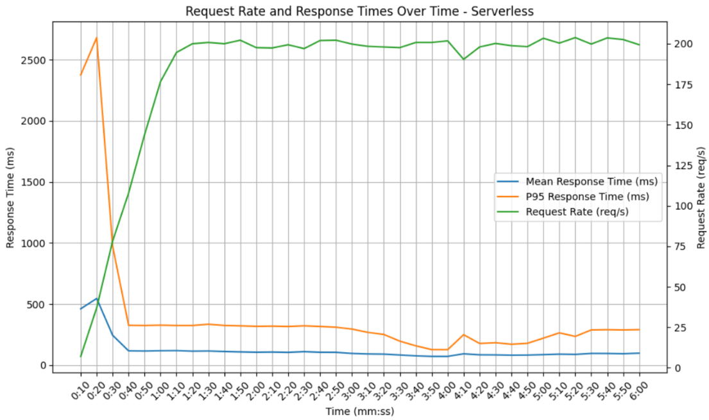
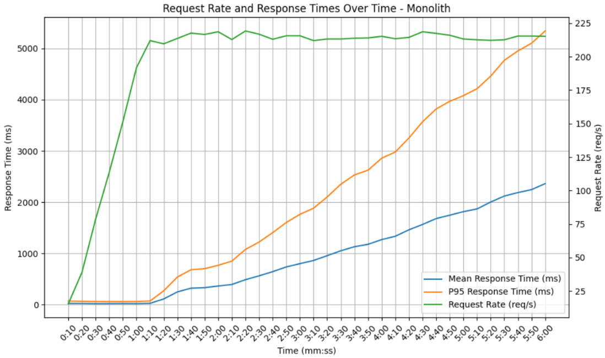

# MetroPack

Part of my master's thesis:
**Implementation of an Event-Driven System in Serverless Architecture Using Domain-Driven Design: A Case Study of AWS Cloud**

---

MetroPack is a parcel delivery platform built as complementary implementation code for a master's thesis comparing a **serverless microservices architecture** on AWS serverless services against a **layered monolithic architecture** on EC2. The system manages the complete lifecycle of a parcel shipment: vendor registration, dynamic pricing and offer creation, offer acceptance, parcel pickup, warehouse logistics, inter-city transfers, last-mile delivery, and monthly vendor billing.

The thesis investigates the feasibility, trade-offs, and empirical performance differences between these two architectural approaches, guided by **Domain-Driven Design (DDD)** principles.

## Load Testing Results - mean response times (ms) and 95th percentile response times (ms)

### Serverless microservices



### Monolith

 

---

## Technology Stack

| Category | Technology |
|---|---|
| **Language** | TypeScript |
| **Runtime** | Node.js 22.x |
| **HTTP framework** | Express 5.x (monolith) |
| **AWS SDK** | AWS SDK v3 |
| **IaC** | AWS SAM (nested CloudFormation stacks) |
| **Database** | Amazon DynamoDB |
| **Async messaging** | Amazon EventBridge (custom buses per service) |
| **Queuing** | Amazon SQS FIFO queues (parcelManagement ordered processing) |
| **API** | Amazon API Gateway REST (IAM auth for cross-service calls) |
| **Routing engine** | OpenRouteService + VROOM |
| **Load testing** | Artillery |
| **Testing** | Jest |
| **CI** | GitHub Actions |

---

## System Architecture

The system is implemented twice using the same domain model and DynamoDB table schemas:

### Serverless Microservices (AWS)
Six independently deployed microservices, each with its own API Gateway, Lambda functions, DynamoDB tables, and EventBridge bus. Services communicate asynchronously via **EventBridge** events and synchronously via **IAM-authenticated API Gateway** calls.

| Service | Responsibility |
|---|---|
| **vendor-service** | Vendor (courier) registration and profile management. Uses event sourcing — vendor state is reconstructed from stored domain events. |
| **dynamicPricing-service** | Time-limited delivery price offer generation between cities. Tracks city capacity (supply/demand) using a daily cron job. Reacts to offer acceptance and cancellation events. |
| **buyer-service** | Orchestrates the `AcceptOfferSaga` — a choreography saga with compensating transactions that coordinates offer acceptance, billing, and parcel registration across services. |
| **billing-service** | Manages monthly per-vendor bills. Listens to `orderCreated` and `orderCreationCancelled` events to add or remove orders from bills. |
| **parcelManagement-service** | The core logistics service. Manages parcel state from registration through pickup, warehouse intake, inter-city transfers, and final delivery using a built-in event-driven vehicle/job simulation engine. |
| **routing-service** | Stateless routing utility. Calls the self-hosted **OpenRouteService (ORS)** API to compute optimised multi-stop delivery routes and snap GPS coordinates to the road network. |

### Layered Monolith (EC2)
An Express application deployed on an EC2 instance, implementing the identical domain logic in a single Model View Controller codebase. It uses the same DynamoDB table schemas (prefixed `Monolith*`) to ensure a fair performance comparison.

---

## Domain-Driven Design Patterns

| Pattern | Usage |
|---|---|
| **Aggregates** | `Vendor`, `Offer`, `Customer`, `Parcel`, `ParcelManagement`, `Tracking` |
| **Event Sourcing** | `VendorTable` and `ParcelTable` store append-only domain event logs; state is reconstructed from the event sequence |
| **Value Objects** | `Month` (billing-service), `Location` (parcelManagement-service) |
| **Saga (orchestration)** | `AcceptOfferSaga` in buyer-service — executes steps with registered compensating actions executed in reverse on failure |
| **Domain Events** | Rich event envelope: `{ version, id, detail-type, source, detail: { metadata: { domain, subdomain, service, category, type, name }, data } }` |
| **Bounded Contexts** | Each microservice is its own bounded context; cross-context communication uses EventBridge events or signed API Gateway calls |

---

## AWS Services

- **AWS Lambda** — all business logic, one function per handler
- **Amazon API Gateway** — HTTP interface per microservice
- **Amazon DynamoDB** — primary data store with GSIs and TTL
- **Amazon EventBridge** — asynchronous inter-service event buses
- **Amazon SQS** (FIFO) — ordered event processing in parcelManagement-service
- **Amazon EventBridge Scheduler** — daily cron jobs (capacity generation, vehicle reset, job preparation)
- **Amazon EC2** — monolith deployment target
- **Amazon S3** — monolith build artifact storage
- **AWS IAM** — fine-grained per-Lambda execution policies

---

## Load Testing

Load tests are run with **Artillery** against both architectures using identical scenarios:

- **"Offer not accepted"** (weight 4): `POST /createOffer`
- **"Offer accepted"** (weight 1): `POST /createOffer` → `GET /vendor/{id}` → `POST /acceptOffer` → `GET /parcel/{id}` → `GET /buyer/{email}` → `POST /bills` → `POST /bill`

Load profiles (defined in `loadTesting/loadTestScenarios.yaml`): `minimal`, `small`, `medium`, `large` (ramp to 100 req/s, steady 300s).

- `loadTesting/loadTest.yaml` — targets the serverless microservices (API Gateway)
- `loadTesting/loadTestMonolith.yaml` — targets the monolith (EC2 port 3000)

---

## Project Structure

```
├── billing-service/          # Billing bounded context (Lambda + DynamoDB + EventBridge)
├── buyer-service/            # Buyer / AcceptOfferSaga bounded context
├── dynamicPricing-service/   # Offer and city capacity bounded context
├── parcelManagement-service/ # Core logistics bounded context
├── routing-service/          # Stateless ORS routing utility
├── vendor-service/           # Vendor registration bounded context (event-sourced)
├── monolith/                 # Layered monolith (Express on EC2) — comparison baseline
├── loadTesting/              # Artillery load test scenarios
├── dataGeneration/           # Seed data generation scripts
├── ors/                      # Self-hosted OpenRouteService (Docker Compose)
├── template.yaml             # Root SAM nested stack
└── samconfig.toml            # SAM deployment configuration
```

---

## Deployment

### Prerequisites

- AWS CLI configured with appropriate permissions
- AWS SAM CLI installed

### Serverless stack

```bash
sam deploy --stack-name metro-pack --parameter-overrides OrsKey=<YOUR_ORS_KEY>
```

### Monolith

Package the monolith and upload to S3, then launch the EC2 instance defined in `monolith/template.yaml`. The EC2 UserData script pulls `metropack-builds/app.zip` from S3, installs dependencies, builds, and starts the server.

```bash
sam deploy --stack-name metro-pack-monolith --config-file monolith/samconfig.toml
```
